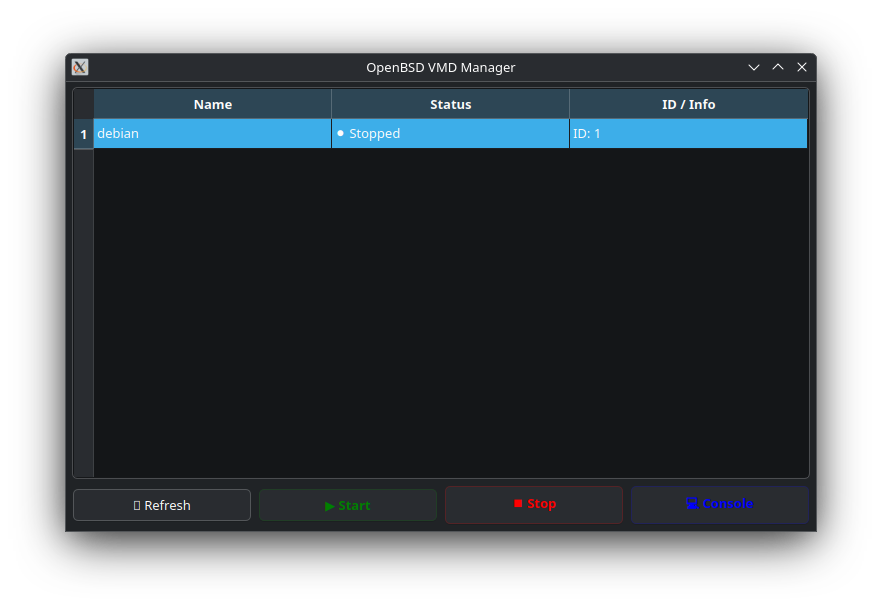

# OpenBSD VMD Manager


A simple, native GUI for managing virtual machines on OpenBSD using `vmd(8)` and `vmctl(8)`.

The goal is to provide a lightweight tool, written in **C++** and **Qt 6**, that integrates visually and functionally with the base system, respecting the OS philosophy.



## Features

* **Smart Detection:** Reads `/etc/vm.conf` to list configured machines.
* **Real-time Status:** Cross-references data with `vmctl status` to visually indicate if VMs are running or stopped.
* **Simple Control:** Start, stop, and open console for virtual machines with a single click.
* **Privilege Separation:** Designed to manage the current user's VMs without requiring `root` or `doas` for GUI operations.
* **Console Access:** Spawns `xterm` connected to the VM serial console.

## Requirements

* **OS:** OpenBSD (Targeting 7.8)
* **Libraries:** Qt 6 (`qt6-qtbase`)
* **Tools:** CMake, C++ Compiler (clang is default)

## Installation

### 1. Install Dependencies
Run the following to install necessary tools:

```ksh
doas pkg_add qt6-qtbase cmake
```

### 2. Build
Follow these steps to build from source:

```ksh
# 1. Create build directory
mkdir build && cd build

# 2. Generate Makefile with CMake
cmake ..

# 3. Compile
make

# 4. Run
./vmConsola
```

## License

This project is released under the **ISC License**, aligned with the OpenBSD philosophy.
See the [LICENSE](LICENSE) file for the full text.

---

### Third Party Credits

This software uses the **Qt 6** framework, licensed under the **GNU Lesser General Public License (LGPL) version 3**.
* Qt is property of The Qt Company Ltd. and other contributors.
* More info at [qt.io](https://www.qt.io).
